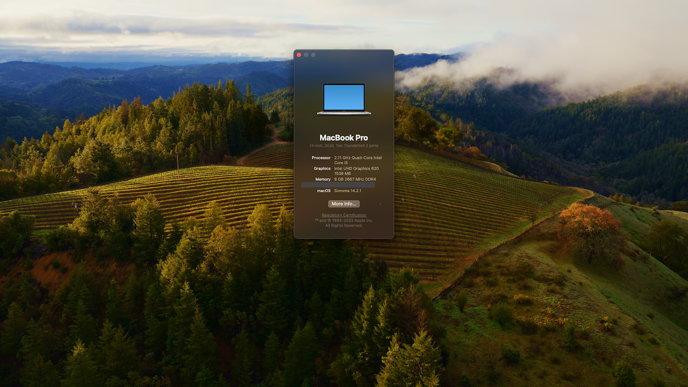

# ThinkPad-L13-Yoga-Hackintosh

**Status: Success | Stable**


[](https://github.com/acidanthera/OpenCorePkg)
[](https://www.apple.com/macos/big-sur)

**DISCLAIMER:**
As you embark on your Hackintosh journey you are encouraged to **READ** the entire README and [Dortania](https://dortania.github.io/getting-started/) guides before you start. It will save many a message instructing you to RTFM. **I am not an expert**, I haven't forced you to do anything, put on your big boy pants and take responsibility for any mess you get yourself into.

All that said I'm happy to help when/where I can. When you encounter bug or want to improve this repo, consider opening an issue or pull request. You can also find a wealth of knowledge on [Reddit](https://www.reddit.com/r/hackintosh/), [TonyMacX86](https://www.tonymacx86.com) or [Google](https://www.google.com).

## Introduction

<details> 
<summary><strong>This is not a guide!</strong></summary>

This is not a guide. It shoud only be used as a reference. I provide some tips and tricks I learned on my journey in building a hackintosh. The best way of using this is as a supplement to the OpenCore guide; if you have questions about how to setup your specific hardware, are unclear about what to do, or would like to see the settings I've used.

I understand that some may simply copy the EFI folder to their EFI partition. For clarity the EFI folder needs to go into the EFI partition.

```EFI
EFI (partition)
	EFI
	├── BOOT
	├── OC
```

It should work and your ThinkPad L13 Yoga should boot and work fine. You will at minimum need to generate SMBIOS values if you want Apple services to work. Note that all error reporting/logging has been turned off in the config.plist. You will have a difficult time trouble shooting with the setup provided. You can easily turn on the error reporting and logging if you follow the Dortania guide. Best of luck.

> **NOTE** if you simply wish to copy my EFI please do the following:
>
> 1. [Generate SMBIOS values](https://dortania.github.io/OpenCore-Install-Guide/config-laptop.plist/coffee-lake-plus.html#nvram) and add them in the config.plist (Use MacBookPro16,3)
> 2. Change the value of `showpicker` to  `true` in the config.plist file to provide the opencore menu when booting. 
> 3. Prepare your install [USB](https://dortania.github.io/OpenCore-Install-Guide/installer-guide/)
> 4. Move the entire EFI folder (with your modifications) to the proper partition on your [USB](https://dortania.github.io/OpenCore-Install-Guide/installer-guide/mac-install.html#setting-up-opencore-s-efi-environment) (or [hard drive](https://dortania.github.io/OpenCore-Post-Install/universal/oc2hdd.html) once the install is complete).
> 5. [Install](https://dortania.github.io/OpenCore-Install-Guide/installation/installation-process.html#double-checking-your-work) - You'll need to select F12 to get the boot menu options and **boot from the USB each time the computer restarts** until you've copied the EFI folder onto the hard drive. You may also need to select the correct boot option during install.

</details>  

<details> 
<summary><strong>This is a guide!</strong></summary>


- To install macOS follow the guides provided by [Dortania](https://dortania.github.io/OpenCore-Install-Guide/)
- Useful tools by [CorpNewt](https://github.com/corpnewt) and [headkaze](https://github.com/headkaze/Hackintool)


</details>  

<details> 
<summary><strong>Shout out and credits</strong></summary>

**Shout out** to [oddish_enthusiast](https://www.reddit.com/user/oddish_enthusiast/) who pointed me in the right direction and let me know when OpenCore 0.6.7 fixed booting on 10th gen processors. (He actually had it working before that).

### Credit to all these great people whom I don't know but have made my hackintosh dreams come true:

- [EETagent](https://github.com/EETagent) for his repository (I like the layout of his guide and used it to create this one)
- The guys from [Acidanthera](https://github.com/acidanthera) that make this possible
- [Apple](http://apple.com) for macOS and HfsPlus.efi
- [corpnewt](https://github.com/corpnewt) for [USBMap](https://github.com/corpnewt/USBMap) and [CPUFriendDataProvider](https://github.com/corpnewt/CPUFriendFriend)
- [headkaze](https://github.com/headkaze) for [Hackintool](https://github.com/headkaze/Hackintool)
- [jwise](https://github.com/jwise) for [HoRNDIS](https://github.com/jwise/HoRNDIS)
- [Mieze](https://github.com/Mieze) for [IntelMausiEthernet](https://github.com/Mieze/IntelMausiEthernet)
- [OpenIntelWireless](https://github.com/OpenIntelWireless/IntelBluetoothFirmware/releases) for [IntelBluetoothFirmware](https://github.com/OpenIntelWireless/IntelBluetoothFirmware)
- [zhen-zen](https://github.com/zhen-zen) for [YogaSMC](https://github.com/zhen-zen/YogaSMC)
- And every other contributor
- People at [r/hackintosh](https://www.reddit.com/r/hackintosh/) for their advice and help

</details>

<details>
<summary><strong> Other Repositories </strong></summary>
<br>


- ThinkPad L13 Yoga -hackintosh repositories:
  - [hagenest/thinkpad-l13-yoga-hackintosh](https://github.com/hagenest/thinkpad-l13-yoga-hackintosh)

</details>  

<details>
<summary><strong>Hardware</strong></summary>
<br>


[](https://pcsupport.lenovo.com/ca/en/products/laptops-and-netbooks/thinkpad-l-series-laptops/thinkpad-l13-yoga-type-20r5-20r6/downloads/ds541927-bios-update-utility-bootable-cd-for-windows-10-64-bit-thinkpad-l13-l13-yoga)

### ThinkPad L13 Yoga

| Category  | Component                                            | Note                                                         |
| --------- | ---------------------------------------------------- | ------------------------------------------------------------ |
| Type      | 20R5, 20R6                                           |                                                              |
| CPU       | Intel Core i5-10210U                                 |                                                              |
| GPU       | Intel UHD                                            |                                                              |
| SSD       | WD 512GB                                             | Replaced cursed PM 981 which still doesn't work reliably     |
| Screen    | 13" FHD 1920x1080                                    | Multi touch and pen support working                          |
| Memory    | 8GB / 2666MHz DDR4                                   |                                                              |
| Battery   | Integrated Li-Polymer 46Wh                           | Single battery                                               |
| Camera    | 720p Camera and 5MP camera                           | Both cameras working                                         |
| Wifi & BT | Intel Wireless-AC 9560                               | Use AirportItlwm for your macOS version and enjoy native Wi-Fi control. |
| Input     | PS2 Keyboard & I2CHID TrackPad (touchscreen and pen) | I'm using [YogaSMC](https://github.com/zhen-zen/YogaSMC) for media keys. |

</details>  

<details>
<summary><strong>Main software</strong></summary>
<br>


| Component     | Version |
| ------------- | ------- |
| macOS Big Sur | 11.2.2  |
| OpenCore      | v0.6.7* |

NOTE: Prior to OpenCore 0.6.7 MacOS would not boot on this computer.

</details>

<details>
<summary><strong>ACPI Files</strong></summary>
<br>

| Component                   |
| --------------------------- |
| ssdt_data.aml               |
| SSDT-AWAC.aml               |
| SSDT-EC-USBX-LAPTOP.aml     |
| SSDT-OCBAT1-lenovoPRO13.aml |
| SSDT-PNLF-CFL.aml           |
| SSDT-RHUB.aml               |
| SSDT-XOSI                   |

</details>

<details>
<summary><strong>Kernel extensions</strong></summary>
<br>

| Kext                   | Version |
| :--------------------- | ------- |
| AirportItlwm           | 1.2.0   |
| AppleALC               | 1.5.8   |
| BrightnessKeys         |         |
| CPUFriend              | 1.2.3   |
| IntelBluetoothFirmware | 1.1.2   |
| IntelBluetoothInjector | 1.1.2   |
| IntelMausi             | 1.0.5   |
| Lilu                   | 1.5.1   |
| SMCBatteryManager      | 1.2.1   |
| SMCProcessor           | 1.2.1   |
| SMCSuperIO             | 1.2.1   |
| USBMap                 | 1.0.0   |
| VirtualSMC             | 1.2.1   |
| VoodooI2C              | 2.6.5   |
| VoodooI2CHID           | 1.0     |
| VoodooPS2Controller    | 2.2.2   |
| WhateverGreen          | 1.4.8   |
| YogaSMC                | 1.4.3   |

</details>
<details>

<summary><strong>UEFI drivers</strong></summary>
<br>

|     Driver      | Version           |
| :-------------: | ----------------- |
|   HfsPlus.efi   | OcBinaryData      |
| OpenRuntime.efi | OpenCorePkg 0.6.7 |
</details>

<details>
    <summary><strong>Screenshot</strong></summary>
    <br>
    <p float="left">
        
    </p>
</details> 


## Before installation

<details>  
<summary><strong>UEFI settings</strong></summary>
<br>

**Config**

- **Keyboard/Mouse**
  - `Trackpoint` **Enabled**
  - `Trackpad` **Enabled**
- **Display**
  - `Boot Display Device` **ThinkPad LCD**
  - `Total Graphics Memory` **512MB**
  - `Boot Time Extension` **Disabled**
- **CPU**
  - `Intel Hyper-Threading Technology` **Enabled**

**Security**


- `Password` **Disabled**
- `Security Chip` **Disabled**
- `Memory Protection -> Execution Prevention` **Enabled**
- `Virtualization -> Intel Virtualization Technology` **Enabled**
- `Virtualization -> Intel VT-d Feature` **Disabled**
- `Virtualization -> Enhanced Windows Biometric Security` **Disabled**
- `I/O Port Access -> FingerPrint Reader` **Disabled**
- `I/O Port Access -> Memory Card Slot` **Disabled**
- `Secure Boot -> Secure Boot` **Disabled**
- `Intel SGX -> Intel SGX Control` **Disabled**
- `Device Guard` **Disabled**

**Startup**

- `UEFI/Legacy Boot` **UEFI Only**
- `CSM Support` **No**
- `Boot Mode` **Diagnostics** (This can be changed to "Quick" once you know your system is running properly)

</details>  

<details>
<summary><strong>Own prev-lang-kbd</strong></summary>
<br>


In the config.plist file you set the default language as outlined in the guide. You can either add it as a string or as a hex data using [ProperTree](https://github.com/corpnewt/ProperTree)

The setting is found in the config.plist under: 

- NVRAM
  - 7C436110-AB2A-4BBB-A880-FE41995C9F82

Format is lang-COUNTRY:keyboard

- 🇺🇸 | [0] en_US - U.S --> en-US:0 --> (656e2d55 533a30 in HEX)

| Key           | Type   | Value   |
| ------------- | ------ | ------- |
| prev-lang:kbd | String | en-US:0 |


It is set to English but you can find alternatives here:

[AppleKeyboardLayouts](https://github.com/acidanthera/OpenCorePkg/blob/master/Utilities/AppleKeyboardLayouts/AppleKeyboardLayouts.txt)

</details>

## Post-Install

<details>  
<summary><strong>TrackPad - Disable force touch</strong></summary>
<br>


If the **Battery** management **doesn't show up** in the System Preferences after the SSDT-OCBAT1-lenovoPRO13.aml file is added to your ACPI folder and config.plist file. You will not be able to change any trackpad settings. You may experience the annoying behaviour of clicking on the touchpad and it doing a **Force Touch** where the preview of the file is shown. I found this very annoying. You can disable force touch by modifying the file in `~/Library/Preferences/com.apple.AppleMultitouchTrackpad.plist`
Opened it with Propertree and changed **ForceSuppressed** to **True**

Another trick to manage your trackpad, if you can't get the battery to work, is to connect a bluetooth trackpad. Once the bluetooth trackpad is connected you can adjust the settings. Disconnect the bluetooth trackpad and your built in one will maintain those settings.

I used these methods prior to adding the SSDT-OCBAT1-lenovoPRO13.aml from [hagenest/thinkpad-l13-yoga-hackintosh](https://github.com/hagenest/thinkpad-l13-yoga-hackintosh) repo.
</details>  

<details>  
<summary><strong>Generate your own SMBIOS</strong></summary>
<br>
[GenSMBIOS](https://github.com/corpnewt/GenSMBIOS)

Use GenSMBIOS to create your own serial #... based off of your preferred model.

- MacBookPro16,3 -`What I used`

**Note:** If you use a different SMBIOS model than the MacbookPro16,3 that I've used. The provided USB mapping will not work.  You will need to edit the **USBMap.kext file**.  You can right click on the file and select **Show Package Contents**.  From there you can open the Info.plist file in ProperTree and change MacBookPro16,3 to whatever Model ID you've chosen. This should provide a working USBMap.kext.

</details>  

<details>  
<summary><strong>CPUFriend power management</strong></summary>
<br>

Generate `CPUFriendDataProvider` or `ssdt_data.aml` (choose one) for your machine [here](https://github.com/fewtarius/CPUFriendFriend) or use the ssd_data.aml file provided. My files are set for power conservation over performance. Highly recommended that you use power management.

</details>  

<details>  
<summary><strong>USB Port Mapping</strong></summary>
<br>


While first port mapping I followed the [Dortania  guide here](https://dortania.github.io/OpenCore-Post-Install/usb/#macos-and-the-15-port-limit) with USBInjectAll.kext install...  when doing so the internal USB ports did not show up and the cameras, touch screen, and bluetooth did not function. I noticed on the `USBmap tool` screen that RHUB was showing so I Googled it and it brought me back to the [Dortania guide here](https://dortania.github.io/OpenCore-Post-Install/usb/manual/manual.html#special-notes). I added the SSDT-RHUB.aml to the APCI folder rebooted and all the ports showed up. I then mapped the USB ports creating the included USBMap.kext file. After mapping the ports I left the SSDT-RHUB.aml file in the APCI folder (not sure if it is still needed?).

</details>  

<details>  
<summary><strong>Audio Setup</strong></summary>
<br>

The L13 Yoga has CX8070 for audio which requires the boot-arg **or** device property below. You can use the boot-args to initially setup your config.plist file as suggested in the guide or simply add the device property. Everything should work, built-in microphone, speakers, headphone jack and microphone. 

| Key       | Value    |
| --------- | -------- |
| boot-args | alcid=15 |

| Key                        | Type       | Value        |
| -------------------------- | ---------- | ------------ |
| PciRoot(0x0)/Pci(0x1F,0x3) | Dictionary |              |
| layout-id                  | Data       | **0f000000** |

</details>  

## Status

<details>  
<summary><strong>What's working ✅</strong></summary>

- [x] Battery percentage
- [x] Bluetooth - Intel Wireless-AC 9560 
- [x] Wifi - Intel Wireless-AC 9560
- [x] CPU power management
- [x] GPU UHD hardware acceleration / performance 
- [x] iMessage, FaceTime, App Store, iTunes Store. `Generate your own SMBIOS`
- [x] Intel I219-V Ethernet port -`works with the Lenovo dongle`
- [x] Keyboard `Volume and brightness hotkeys, with YogaSMC and BrightnessKey kexts`
- [x]  Audio - Conexant CX8070 -`"alcid=15" -See setup above`
- [x] Microphone
- [x] Sleep/Wake 
- [x] TrackPoint  `Works perfectly. Just like on Windows or Linux.`
- [x] USB Ports `USB map created.`
- [x] Web camera `Both cameras are working after the USB mapping was done.`
- [x] TouchPad `1-3 fingers swipe gestures`
- [x] Multi-Touch Screen `Pen also working`
- [x] Graphical Boot menu `OpenCanopy (It does work. Not included in OC folder as I skip the boot menu.)` 

</details>  

<details>  
<summary><strong>What's not working ⚠️</strong></summary>

- [ ] Fingerprint reader - `While there is finally a working driver for Linux (python-validity), don't expect macOS driver any time soon.`
- [ ] Samsung PM 981 NVME drive - `Still unstable. Could work for some, not for others.`

</details>  

<details>  
<summary><strong>Untested</strong></summary>

- [ ] Boot chime
- [ ] HDMI
- [ ] FileVault 2
- [ ] Sidecar wired
- [ ] Sidecar wireless
- [ ] Windows/Linux from OC boot menu `Not dual booting this system`

</details> 